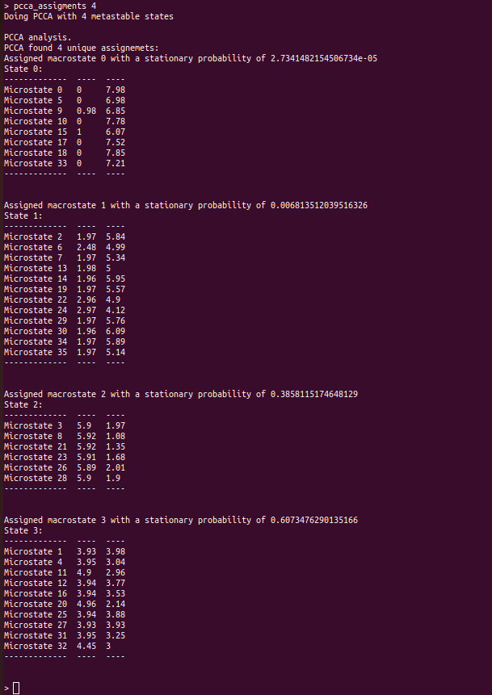
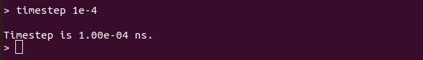
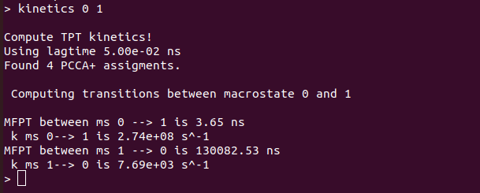

# MSManalysis

## Description

This Python program provides an easy-to-use, interactive environment for analyzing Markov State Models (MSMs) generated using the deeptime library.
Users can supply a list of MSMs created at different lag times, along with the corresponding microstate trajectories used to build them. The program enables users to assess Markovianity and compute key kinetic properties: mean first passage times (MFPTs) and event rates.

---

## Table of Contents

- [Installation](#installation)
- [Usage](#usage)
- [Available commands](#available-commands)
- [Examples](#examples)
- [License](#license)
- [Contact](#contact)

---

## Installation

To install the directory from GitHub:

```bash
# Clone the repository
git clone https://github.com/SNS-Brancato-Lab/MSManalysis.git

# Navigate to the script directory
cd MSManalysis

# Install all the required modules
pip install -r requirements.txt
```

In order to use the program, the following modules must be installed:

- deeptime
- numpy
- matplotlib
- scipy
- pickle

---

## Usage

MSManalysis operates through terminal commands.
Commands have the general sintax:

```
# general commands
commands arg1 arg2 ...
```

Commands can be executed in two ways: by providing them interactively in the command line, or by reading them from an input file in batch mode.

a. **Batch mode**

```bash
# Batch mode
python main.py -i input.in
```

'input.in' is a text file containing commands for the analysis of MSMs.
Words after '#' will be interpreted as comments and ignored.

```
#example of a command file
command1 arg1 arg2 #comment1
command2 arg3 arg4 #comment2
quit #exit the program

```

b. **Interactive mode**

```bash
# Interactive mode
python main.py
```

Interactive mode is automatically activated if no command input file is provided.


See [Available commands](#available-commands) for specific command details.

---

## Available commands

**center_info**
```
 center_info [-h]
```

Print information on microstates.
This command shows a table with loaded microstates and their CVs values.

**ck_test**
```
 ck_test [-h] N_macrostates
```

Perform Chapman-Kolmogorov analysis with a chosen number of macrostate.
This command perform Chapman-Kolmogorov analysis with a chosen set of macrostate. A MSM must be selected before with 'select_model'.

**kinetics**
```
 kinetics [-h] STATE_A STATE_B
```

Compute kinetic analysis between two macrostate.
This command computes mean first passage times (in ns) and rates (in s^-1) between two macrostate.If PCCA+ has not be performed, single microstates will be used. A MSM must be selected before with 'select_model'.

**load_centers**
```
 load_centers [-h] CENTERS_FILE
```

Load MSMs microstate from a file.
This command load MSM microstates from a .pkl file.

**load_models**
```
 load_models [-h] MODELS_FILE
```

Load MSMs from a file.
This command load MSMs from a .pkl file.

**mftp**
```
 mftp [-h] MICROSTATE_A MICROSTATE_B
```

Comute mean first passage times (in ns) between two microstates.
This command computes mean first passage times (in ns) between two microstates. A MSM must be selected before with 'select_model'.

**pcca_assigments**
```
 pcca_assigments [-h] N_macrostates
```

Perform PCCA+ with a chosen number of macrostates on a selected MSM.
This command perform PCCA+ with a chosen number of macrostates on a selected MSM. If no number of macrostates is provided, the PCCA+ will be performed with 2 macrostates. A MSM must be selected before with 'select_model'.

**plot_its**
```
 plot_its [-h] N_eigenvalues
```

Perform and plot the implied timescale analysis of a given number of eigenvalue.
This command perform and plot the implied timescale analysis. If no number of eigenvalue is provided, only the first eigenvalue will be shown.

**quit**
```
 quit [-h]
```

Terminate the program.
This command terminate the execution of the program.

**select_model**
```
 select_model [-h] LAGTIME
```

Select the MSM to analyze choosing the lagtime (in step units).
This command selects a MSM by providing a lagtime (in step units). If the provided lagtime is not present in the loaded MSMs, the MSM with the closest lagtime will be chosen.

**timestep**
```
 timestep [-h] TIMESTEP
```

Set the conversion unit between step units and ns.
This command sets the conversion unit between step units nanosecond. If no timestep is provided, it will print the active timestep unit conversion value.

## Examples

In this example, a MSM analysis will be shown on a 2 collective variables system with 4 macrostates.
Models and microstates can be found in 'MSManalysis/example/'.
This example can be used as a standard workflow for MSManalysis.

1. **Launch MSManalysis in interactive mode**

```bash
python main.py
```


*Launching MSManalysis*

2. **Load microstates**

```
load_centers example/centers.pkl
```


*Loading microstate for MSM analysis. Microstates should be provided as a .pkl file containing microstates as an array
with rows equal to the number of states and columns equal to the state dimensions.*

3. **Load MSMs**

```
load_models example/models.pkl
```


*Loading models for MSM analysis. MSMs should be provided as a list of MSMs evaluated at different lagtime.*

4. **Markovianity validation pt. 1: implied timescales**

```
plot_its 4
```


*Plotting implied timescales for Markovianity validation. This test identifies the smallest lagtime at wich the system could exibit markovian behavior.*

5. **Select a MSM by lagtime**

```
select_model 500
```


*Selecting a MSM by lagtime. We suggest to use the lagtime identified in the previous step.*

6. **Markovianity validation pt. 2: Chapman-Kolmogorov test**

```
ck_test 5
```


*Chapman-Kolmogorov test. Perform this text to asses the markovian behavior of the selected model.*

7. **Find macrostates with PCCA+**

```
pcca_assigments 4
```


*Finding macrostates with PCCA+. With this method is possible to reduce the transition matrix of the selected model and identify the main macrostates.*

8. **Set the correct timestep**

```
timestep 1e-4
```



*Selecting the correct timestep. It is the time interval used to collect data from the trajectory.*

8. **Compute kinetics between macrostates**

```
kinetics 0 1
```



*Computing kinetics between macrostate 0 and macrostate 1. This analysis uses transition path theory to extract mean first passage times and rates from a MSM.*

---

## License

---

## Contact

For further information or any other request, please contact the autor at his email adress.

- **Author:** Luca Benedetti
- **Email:** [luca.benedetti@sns.it](mailto\:luca.benedetti@sns.it)
