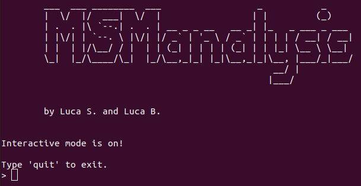
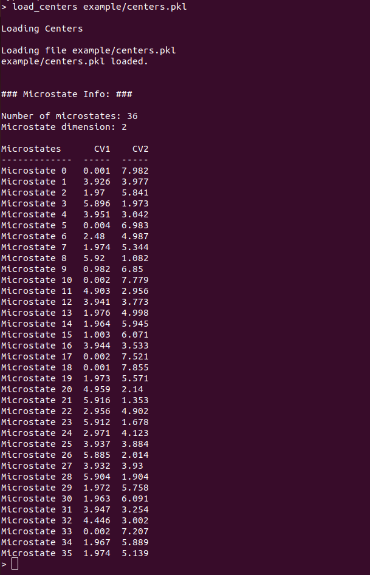
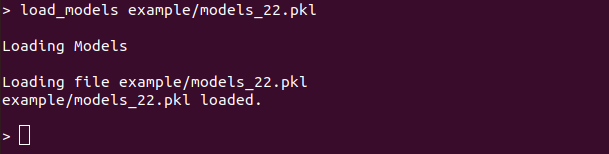
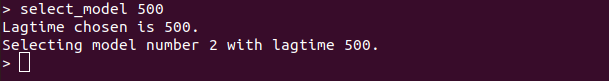

# MSManalysis

## Description

This python program allows an easy and interactive analysis of Markov State Models (MSMs) generated with deeptime library.
Users can provide a list of MSMs at different lagtimes with the microstates used to generate the MSMs, then test the markovianity and compute kinetical data (mean first passage times and event rates).

---

## Table of Contents

- [Installation](#installation)
- [Usage](#usage)
- [Available commands](#available-commands)
- [Examples](#examples)
- [License](#license)
- [Contact](#contact)

---

## Installation

To install the directory from GitHub:

```bash
# Clone the repository
git clone https://github.com/SNS-Brancato-Lab/MSManalysis.git

# Navigate to the script directory
cd MSManalysis

# Install all the required modules
pip install -r requirements.txt
```

In order to use the program, the following modules must be installed:

- deeptime
- numpy
- matplotlib
- scipy
- pickle

---

## Usage

MSManalysis works provinding commands in the terminal. Commands can be provided inside an input file (batch mode) or inserted directly in the command line (interactive mode).

a. **Batch mode**

```bash
# Batch mode
python main.py -i input.in
```

'input.in' is a text file containing commands for the analysis of MSMs.

b. **Interactive mode**

```bash
# Interactive mode
python main.py
```

Interactive mode is automatically activated if no command file is provided.

Commands have the general sintax:

```
# general commands
commands arg1 arg2 ...
```
The input file must be a text file with a list of commands.  Words after '#' will be interpreted as comments and ignored.

'''
#example of a command file
command1 arg1 arg2 #comment1
command2 arg3 arg4 #comment2
quit #exit the program
'''

See [Available commands](#available-commands) for specific command details.

---

## Available commands

**center_info**
```
 center_info [-h]
```

Print information on microstates.
This command shows a table with loaded microstates and their CVs values.

**ck_test**
```
 ck_test [-h] N_macrostates
```

Perform Chapman-Kolmogorov analysis with a chosen number of macrostate.
This command perform Chapman-Kolmogorov analysis with a chosen set of macrostate. A MSM must be selected before with 'select_model'.

**kinetics**
```
 kinetics [-h] STATE_A STATE_B
```

Compute kinetic analysis between two macrostate.
This command computes mean first passage times (in ns) and event rates in 1us between two macrostate.If PCCA+ has not be performed, single microstates will be used. A MSM must be selected before with 'select_model'.

**load_centers**
```
 load_centers [-h] CENTERS_FILE
```

Load MSMs microstate from a file.
This command load MSM microstates from a .pkl file.

**load_models**
```
 load_models [-h] MODELS_FILE
```

Load MSMs from a file.
This command load MSMs from a .pkl file.

**mftp**
```
 mftp [-h] MICROSTATE_A MICROSTATE_B
```

Comute mean first passage times (in ns) between two microstates.
This command computes mean first passage times (in ns) between two microstates. A MSM must be selected before with 'select_model'.

**pcca_assigments**
```
 pcca_assigments [-h] N_macrostates
```

Perform PCCA+ with a chosen number of macrostates on a selected MSM.
This command perform PCCA+ with a chosen number of macrostates on a selected MSM. If no number of macrostates is provided, the PCCA+ will be performed with 2 macrostates. A MSM must be selected before with 'select_model'.

**plot_its**
```
 plot_its [-h] N_eigenvalues
```

Perform and plot the implied timescale analysis of a given number of eigenvalue.
This command perform and plot the implied timescale analysis. If no number of eigenvalue is provided, only the first eigenvalue will be shown.

**quit**
```
 quit [-h]
```

Terminate the program.
This command terminate the execution of the program.

**select_model**
```
 select_model [-h] LAGTIME
```

Select the MSM to analyze choosing the lagtime (in step units).
This command selects a MSM by providing a lagtime (in step units). If the provided lagtime is not present in the loaded MSMs, the MSM with the closest lagtime will be chosen.

**timestep**
```
 timestep [-h] TIMESTEP
```

Set the conversion unit between step units and ns.
This command sets the conversion unit between step units nanosecond. If no timestep is provided, it will print the active timestep unit conversion value.

## Examples

In this example, a MSM analysis will be shown on a 2 collective variables system with 5 macrostates. Models and microstates can be found in 'MSManalysis/example/'.
This example can be used as a standard workflow for MSManalysis.

1. **Launch MSManalysis in interactive mode**

```bash
python main.py
```



***Launching MSManalysis***

2. **Load microstates**

```
load_centers example/centers_22.pkl
```



***Loading microstate for MSM analysis***

3. **Load MSMs**

```
load_models example/models_22.pkl
```



***Loading models for MSM analysis***

4. **Markovianity validation pt. 1: implied timescales**

```
plot_its 4
```


***Plotting implied timescales for Markovianity validation***

5. **Select a MSM by its lagtime**

```
select_model 300
```



***Selecting a MSM by its lagtime***

6. **Markovianity validation pt. 2: Chapman-Kolmogorov test**

```
ck_test 4
```


***Chapman-Kolmogorov test***

7. **PCCA+**

```
pcca_assigments 5
```


---

## License

---

## Contact

For further information or any other request, please contact the autor at his email adress.

- **Author:** Luca Benedetti
- **Email:** [luca.benedetti@sns.it](mailto\:luca.benedetti@sns.it)
