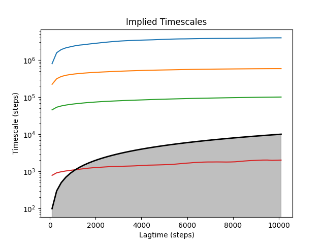
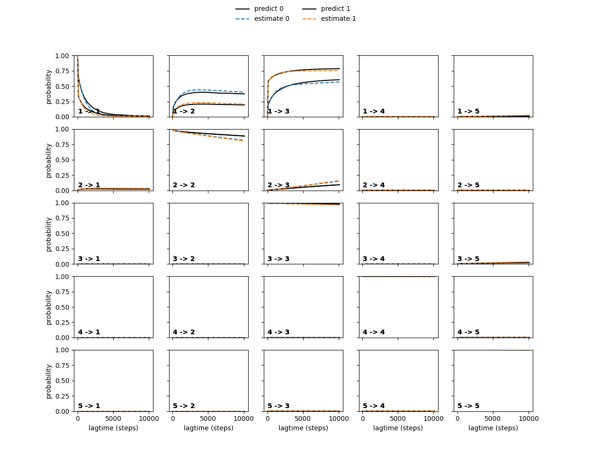

# MSManalysis

## Description

This Python program provides an easy-to-use, interactive environment for analyzing Markov State Models (MSMs) generated using the deeptime library.
Users can supply a list of MSMs created at different lag times, along with the corresponding microstate trajectories used to build them. The program enables users to assess Markovianity and compute key kinetic properties: mean first passage times (MFPTs) and event rates.

The program can be also used as a python module to generate MSMs from a series of short trajectories. Generated MSMs can be then analyzed with this program.

---

## Table of Contents

- [Installation](#installation)
- [Usage](#usage)
- [Available commands](#available-commands)
- [Example: generate MSMs](#example-generate-msms)
- [Example: analysis of MSMs](#example-analysis-of-msms)
- [License](#license)
- [Contact](#contact)

---

## Installation

To install the directory from GitHub:

```bash
# Clone the repository
git clone https://github.com/SNS-Brancato-Lab/MSManalysis.git

# Navigate to the script directory
cd MSManalysis

# Install all the required modules
pip install -r requirements.txt
```

In order to use the program, the following modules must be installed:

- deeptime
- numpy
- matplotlib
- scipy
- pickle

---

## Usage

MSManalysis operates through terminal commands.
Commands have the general sintax:

```
# general commands
commands arg1 arg2 ...
```

Commands can be executed in two ways: by providing them interactively in the command line, or by reading them from an input file in batch mode.

a. **Batch mode**

```bash
# Batch mode
python main.py -i input.in
```

'input.in' is a text file containing commands for the analysis of MSMs.
Words after '#' will be interpreted as comments and ignored.

```
#example of a command file
command1 arg1 arg2 #comment1
command2 arg3 arg4 #comment2
quit #exit the program

```

b. **Interactive mode**

```bash
# Interactive mode
python main.py
```

Interactive mode is automatically activated if no command input file is provided.


See [Available commands](#available-commands) for specific command details.

---

## Available commands

**center_info**
```
 center_info [-h]
```

Print information on microstates.
This command shows a table with loaded microstates and their CVs values.

**ck_test**
```
 ck_test [-h] N_macrostates
```

Perform Chapman-Kolmogorov analysis with a chosen number of macrostate.
This command perform Chapman-Kolmogorov analysis with a chosen set of macrostate. A MSM must be selected before with 'select_model'.

**kinetics**
```
 kinetics [-h] STATE_A STATE_B
```

Compute kinetic analysis between two macrostate.
This command computes mean first passage times (in ns) and rates (in s^-1) between two macrostate.If PCCA+ has not be performed, single microstates will be used. A MSM must be selected before with 'select_model'.

**load_centers**
```
 load_centers [-h] CENTERS_FILE
```

Load MSMs microstate from a file.
This command load MSM microstates from a .pkl file.

**load_models**
```
 load_models [-h] MODELS_FILE
```

Load MSMs from a file.
This command load MSMs from a .pkl file.

**mftp**
```
 mftp [-h] MICROSTATE_A MICROSTATE_B
```

Comute mean first passage times (in ns) between two microstates.
This command computes mean first passage times (in ns) between two microstates. A MSM must be selected before with 'select_model'.

**pcca_assigments**
```
 pcca_assigments [-h] N_macrostates
```

Perform PCCA+ with a chosen number of macrostates on a selected MSM.
This command perform PCCA+ with a chosen number of macrostates on a selected MSM. If no number of macrostates is provided, the PCCA+ will be performed with 2 macrostates. A MSM must be selected before with 'select_model'.

**plot_its**
```
 plot_its [-h] N_eigenvalues
```

Perform and plot the implied timescale analysis of a given number of eigenvalue.
This command perform and plot the implied timescale analysis. If no number of eigenvalue is provided, only the first eigenvalue will be shown.

**quit**
```
 quit [-h]
```

Terminate the program.
This command terminate the execution of the program.

**select_model**
```
 select_model [-h] LAGTIME
```

Select the MSM to analyze choosing the lagtime (in step units).
This command selects a MSM by providing a lagtime (in step units). If the provided lagtime is not present in the loaded MSMs, the MSM with the closest lagtime will be chosen.

**timestep**
```
 timestep [-h] TIMESTEP
```

Set the conversion unit between step units and ns.
This command sets the conversion unit between step units nanosecond. If no timestep is provided, it will print the active timestep unit conversion value.

## Example: generate MSMs

This example shows how to use the python modules of MSManalysis to generate and save MSMs, toghether with trajectory, microstates and discretized trajectory. Since trajectory generation and clustering could be computationally demanding in term of memory and resources, it is highly recommended to perform these tasks on a HPC cluster.

1. **Import required modules and generate MSM object**

```python
import numpy as np
from src import System

MSM = System()
```

2. **Generate and save trajectory**

```python
# generate and save trajectory
dir_traj = 'path/to/dir' #here insert the path to traj directory
# generate and save trajectory
MSM.generate_traj(dir=dir_traj)
```

Trajectory is generated from a series of small trajectories collected in a directory as text files. The directory must contain only trajectory text files. Trajectory is saved as 'traj.pkl' file
 
3. **Generate microstates, discretized trajectories and MSMs**

```python
# generates MSM at different clustering and lagtimes
centers_array = np.arange(6, 20) #here insert the range of number of microstates to test
lagtimes = np.arange(100, 1000, 10) #here insert the range of lagtimes to test

for n_centers in centers_array:

    # generate and save microstate and discretized trajectory
    MSM.generate_centers_dtraj(n_centers=n_centers)

    # generate and save MSMs
    MSM.generate_model(lagtimes=lagtimes)
```

Generate and save different number of microstates and discretized trajectories and correspondent MSMs at various lagtimes. Microstates, discretized trajectoryes and MSMs are saved as 'centers_n.pkl', 'dtraj_n.pkl' and 'models_n.pkl' files, where 'n' is the number of microstates used in the generation process. See the next example on how to analyze MSMs.


The full script is available in example/MSMgenerator_example.py

## Example: analysis of MSMs

In this example, a MSM analysis will be shown on a 2 collective variables system with 4 macrostates.
Models and microstates can be found in 'MSManalysis/example/'.
This example can be used as a standard workflow for MSManalysis.

1. **Launch MSManalysis in interactive mode**

```bash
python main.py
```

```

        ___  ___ ________  ___                  _           _     
        |  \/  |/  ___|  \/  |                 | |         (_)    
        | .  . |\ `--.| .  . | __ _ _ __   __ _| |_   _ ___ _ ___ 
        | |\/| | `--. \ |\/| |/ _` | '_ \ / _` | | | | / __| / __|
        | |  | |/\__/ / |  | | (_| | | | | (_| | | |_| \__ \ \__|
        \_|  |_/\____/\_|  |_/\__,_|_| |_|\__,_|_|\__, |___/_|___/
                                                   __/ |          
                                                  |___/ 
            
          
        by Luca Benedetti and Luca Sagresti
          

Interactive mode is on!

Type 'quit' to exit.
> 

```

2. **Load microstates**

```
load_centers example/centers.pkl
```

The first step is loading microstates used to discretize the trajectory and generate MSMs. Microstates should be provided as a .pkl file containing microstates as an array
with rows equal to the number of states and columns equal to the trajectory dimensions. In this example, the 2D trajectory was discretized using 36 microstates.

```
> load_centers example/centers.pkl

Loading Centers

Loading file example/centers.pkl
example/centers.pkl loaded.


### Microstate Info: ###

Number of microstates: 36
Microstate dimension: 2

Microstates      CV1    CV2
-------------  -----  -----
Microstate 0   0.001  7.982
Microstate 1   3.926  3.977
Microstate 2   1.97   5.841
Microstate 3   5.896  1.973
Microstate 4   3.951  3.042
Microstate 5   0.004  6.983
Microstate 6   2.48   4.987
Microstate 7   1.974  5.344
Microstate 8   5.92   1.082
Microstate 9   0.982  6.85
Microstate 10  0.002  7.779
Microstate 11  4.903  2.956
Microstate 12  3.941  3.773
Microstate 13  1.976  4.998
Microstate 14  1.964  5.945
Microstate 15  1.003  6.071
Microstate 16  3.944  3.533
Microstate 17  0.002  7.521
Microstate 18  0.001  7.855
Microstate 19  1.973  5.571
Microstate 20  4.959  2.14
Microstate 21  5.916  1.353
Microstate 22  2.956  4.902
Microstate 23  5.912  1.678
Microstate 24  2.971  4.123
Microstate 25  3.937  3.884
Microstate 26  5.885  2.014
Microstate 27  3.932  3.93
Microstate 28  5.904  1.904
Microstate 29  1.972  5.758
Microstate 30  1.963  6.091
Microstate 31  3.947  3.254
Microstate 32  4.446  3.002
Microstate 33  0.002  7.207
Microstate 34  1.967  5.889
Microstate 35  1.974  5.139
```

3. **Load MSMs**

```
load_models example/models.pkl
```

The next step is to load MSMs generated with the loaded microstates at different lagtimes. MSMs could be also loaded without any microstates. A default array of microstates will be generated but without any information on the actual location nor dimensions of the real microstates. Models must be provided as a .pkl containing a list of MSMs generated at different lagtime.

```
> load_models example/models.pkl

Loading Models

Loading file example/models.pkl
example/models.pkl loaded.
```

4. **Markovianity validation pt. 1: implied timescales**

```
plot_its 4
```

The implied timescale plot helps to identify the resolved mode of the system and find the smallest lagtime at which Markovianity could be exibited.




5. **Select a MSM by lagtime**

```
select_model 500
```

After the identification of a proper lagtime in the previous step, select the correpondent MSM. If the desired lagtime is not present, the MSM with the closest lagtime will be selected.

```
> select_model 500
Lagtime chosen is 500.
Selecting model number 2 with lagtime 500.
```

6. **Markovianity validation pt. 2: Chapman-Kolmogorov test**

```
ck_test 5
```

Asses Markovian behavior of the selected model with Chapman-Kolmogorov test.




7. **Find macrostates with PCCA+**

```
pcca_assigments 4
```

Use PCCA+ to reduce the transition matrix of the selected MSM and find macrostates.
Usually, a good number of macrostates corresponds to the number of modes resolved in the implied timescale test.
In this example, the 4 macrostates corresponds to similar values of the two collective variables used to analyze the system.

```
> pcca_assigments 4
Doing PCCA with 4 metastable states

PCCA analysis.
PCCA found 4 unique assignemets:
Assigned macrostate 0 with a stationary probability of 2.7341482154506734e-05
State 0:
-------------  ----  ----
Microstate 0   0     7.98
Microstate 5   0     6.98
Microstate 9   0.98  6.85
Microstate 10  0     7.78
Microstate 15  1     6.07
Microstate 17  0     7.52
Microstate 18  0     7.85
Microstate 33  0     7.21
-------------  ----  ----


Assigned macrostate 1 with a stationary probability of 0.006813512039516326
State 1:
-------------  ----  ----
Microstate 2   1.97  5.84
Microstate 6   2.48  4.99
Microstate 7   1.97  5.34
Microstate 13  1.98  5
Microstate 14  1.96  5.95
Microstate 19  1.97  5.57
Microstate 22  2.96  4.9
Microstate 24  2.97  4.12
Microstate 29  1.97  5.76
Microstate 30  1.96  6.09
Microstate 34  1.97  5.89
Microstate 35  1.97  5.14
-------------  ----  ----


Assigned macrostate 2 with a stationary probability of 0.3858115174648129
State 2:
-------------  ----  ----
Microstate 3   5.9   1.97
Microstate 8   5.92  1.08
Microstate 21  5.92  1.35
Microstate 23  5.91  1.68
Microstate 26  5.89  2.01
Microstate 28  5.9   1.9
-------------  ----  ----


Assigned macrostate 3 with a stationary probability of 0.6073476290135166
State 3:
-------------  ----  ----
Microstate 1   3.93  3.98
Microstate 4   3.95  3.04
Microstate 11  4.9   2.96
Microstate 12  3.94  3.77
Microstate 16  3.94  3.53
Microstate 20  4.96  2.14
Microstate 25  3.94  3.88
Microstate 27  3.93  3.93
Microstate 31  3.95  3.25
Microstate 32  4.45  3
-------------  ----  ----

```

8. **Set the correct timestep**

```
timestep 1e-4
```

Set the correct value of the conversion unit between step units and time in nanosecond. The timestep is the time interval used to collect data in the trajectory.

```
> timestep 1e-4

Timestep is 1.00e-04 ns.
```


8. **Compute kinetics between macrostates**

```
kinetics 0 1
```

Finally, compute kinetics between macrostates. Using transition path teory (TPT), it is possible to evaluate mean first passage times and kinetic rates between mascrostates.

```
> kinetics 0 1

Compute TPT kinetics!
Using lagtime 5.00e-02 ns
Found 4 PCCA+ assigments.

 Computing transitions between macrostate 0 and 1

MFPT between ms 0 --> 1 is 3.65 ns 
 k ms 0--> 1 is 2.74e+08 s^-1
MFPT between ms 1 --> 0 is 130082.53 ns 
 k ms 1--> 0 is 7.69e+03 s^-1
```


**Using input file for batch mode**
The same results can be obtained using batch mode with the following command input file:

```
load_centers example/centers.pkl
load_models example/models.pkl
select_model 500
pcca_assigments 4
timestep 1e-4
kinetics 0 1
```

---

## License
MIT License

Copyright (c) [2025] [SNS Brancato Lab]

Permission is hereby granted, free of charge, to any person obtaining a copy
of this software and associated documentation files (the "Software"), to deal
in the Software without restriction, including without limitation the rights
to use, copy, modify, merge, publish, distribute, sublicense, and/or sell
copies of the Software, and to permit persons to whom the Software is
furnished to do so, subject to the following conditions:

The above copyright notice and this permission notice shall be included in all
copies or substantial portions of the Software.

THE SOFTWARE IS PROVIDED "AS IS", WITHOUT WARRANTY OF ANY KIND, EXPRESS OR
IMPLIED, INCLUDING BUT NOT LIMITED TO THE WARRANTIES OF MERCHANTABILITY,
FITNESS FOR A PARTICULAR PURPOSE AND NONINFRINGEMENT. IN NO EVENT SHALL THE
AUTHORS OR COPYRIGHT HOLDERS BE LIABLE FOR ANY CLAIM, DAMAGES OR OTHER
LIABILITY, WHETHER IN AN ACTION OF CONTRACT, TORT OR OTHERWISE, ARISING FROM,
OUT OF OR IN CONNECTION WITH THE SOFTWARE OR THE USE OR OTHER DEALINGS IN THE
SOFTWARE.
---

## Contact

For further information or any other request, please contact the autor at his email adress.

- **Author:** Luca Benedetti
- **Email:** [luca.benedetti@sns.it](mailto\:luca.benedetti@sns.it)
